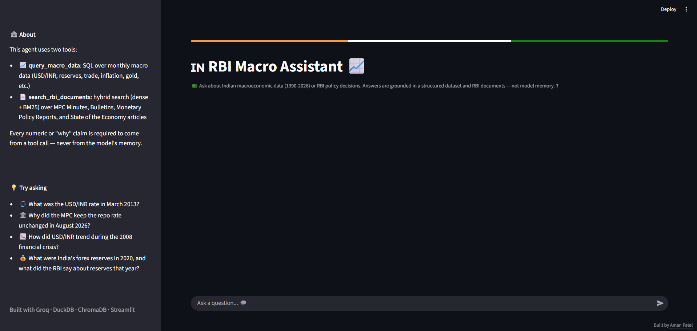

# 🇮🇳 RBI Macro Assistant

A tool-calling AI agent that answers questions about the Indian economy by combining a structured macroeconomic dataset with RBI policy documents — grounded, source-cited answers instead of LLM guesswork.



## Why this project

Most "ask your data" demos either do text-to-SQL *or* RAG over documents, rarely both — and rarely with honest evaluation of how often the model actually gets it right. This project builds both, as two tools inside a single agent that decides which one (or both) a question needs, and measures accuracy with an auto-generated evaluation set rather than eyeballing a few examples.

## What it can answer

- **Numeric / factual**: "What was the USD/INR rate in March 2013?"
- **Policy reasoning**: "Why did the MPC keep the repo rate unchanged in August 2026?"
- **Combined**: "Why did the MPC hold rates in August 2026, and what was the exact USD/INR rate that month?"

Every number comes from a live SQL query against the dataset; every "why" claim comes from a retrieved document chunk — never from the model's memory.

## Architecture

```
                     ┌─────────────────────┐
  User question ───▶ │   Agent (Groq LLM)   │
                     │  decides which tool  │
                     └─────┬──────────┬─────┘
                           │          │
              ┌────────────▼──┐   ┌───▼─────────────────┐
              │ query_macro_   │   │ search_rbi_         │
              │ data (SQL)     │   │ documents (RAG)     │
              └───────┬────────┘   └─────────┬───────────┘
                      │                       │
              ┌───────▼────────┐   ┌──────────▼───────────┐
              │ DuckDB          │   │ Hybrid retrieval:     │
              │ 83-column       │   │ dense (MiniLM) + BM25 │
              │ macro dataset   │   │ via Reciprocal Rank    │
              │ (1990-2026)     │   │ Fusion + date filtering│
              └─────────────────┘   └──────────┬───────────┘
                                                │
                                      ┌─────────▼───────────┐
                                      │ ChromaDB             │
                                      │ 658 chunks from 10    │
                                      │ RBI documents (MPC     │
                                      │ Minutes, Bulletins,     │
                                      │ MPR, State of Economy)  │
                                      └─────────────────────────┘
```

## Key design decisions

- **Two tools, not one blended pipeline.** Numbers and reasoning have different failure modes, so they're handled by purpose-built tools (SQL guardrails for one, hybrid retrieval for the other) rather than one generic "search everything" layer.
- **Hybrid retrieval (dense + BM25 + RRF).** Pure dense search with a small embedding model missed the right document chunk when the query and the answer used different wording. BM25 catches exact keyword overlap that dense search misses, and Reciprocal Rank Fusion combines both rankings.
- **Date-aware filtering.** With multiple MPC meetings and reports covering similar recurring topics, a generic query could rank the *wrong month's* document above the right one. When a question names a month/year, the agent narrows the search to that period first.
- **SQL guardrails.** Only `SELECT`/`WITH` queries run, destructive keywords are blocked, and a row limit is enforced — the agent can read the data, never modify it.
- **Auto-generated evaluation**, not hand-picked examples. The eval set samples real rows from the dataset so the ground truth is never guessed, and tolerance-based matching handles rounding/sign-phrasing differences.

## Evaluation results

**SQL Agent** — 40 auto-generated questions sampled from the real dataset:

| Metric | Result |
|---|---|
| Accuracy | 40/40 (100%) |
| Tool-grounding rate | 100% (zero hallucinated numbers) |

## Tech stack

| Layer | Tool |
|---|---|
| LLM / agent | Groq (`openai/gpt-oss-20b`), tool-calling |
| Structured data | DuckDB, pandas |
| Document parsing | PyMuPDF |
| Embeddings | sentence-transformers (`all-MiniLM-L6-v2`) |
| Vector store | ChromaDB |
| Keyword search | rank-bm25 |
| UI | Streamlit |

## Project structure

```
rbi-macro-assistant/
├── app/
│   └── streamlit_app.py       # Chat UI
├── src/
│   ├── config.py
│   ├── sql_tool/               # DuckDB loading, schema, safe query execution
│   ├── rag_tool/                # PDF parsing, cleaning, chunking, embedding,
│   │                             # vector store, hybrid retrieval
│   └── agent/                   # Tool schemas, system prompt, orchestrator
├── scripts/
│   ├── ingest_pdfs.py           # One-command PDF ingestion pipeline
│   └── inspect_chunks.py        # Diagnostic: list a document's stored chunks
├── evaluation/
│   ├── build_eval_set.py        # Auto-generates eval questions from the data
│   └── run_sql_eval.py          # Runs the agent against the eval set
├── data/
│   ├── structured/              # Master CSV + DuckDB file
│   ├── raw_pdfs/                # Source RBI documents
│   └── eval/                    # Generated eval sets + results
├── assets/
│   └── Screenshot.png           # UI screenshot (used above)
└── requirements.txt
```

## Setup

```bash
git clone https://github.com/Aman-Ptl/rbi-macro-assistant.git
cd rbi-macro-assistant
pip install -r requirements.txt
```

Create a `.env` file in the project root:
```
GROQ_API_KEY=your-groq-api-key
```
(Free, no card required — sign up at [console.groq.com](https://console.groq.com))

**1. Load the structured dataset:**
```bash
python -m src.sql_tool.db_loader
```

**2. Ingest the RBI documents** (place PDFs in `data/raw_pdfs/` first):
```bash
python -m scripts.ingest_pdfs
```

**3. Run the agent from the CLI:**
```bash
python -m src.agent.orchestrator "What was the USD/INR rate in March 2013?"
```

**4. Or launch the UI:**
```bash
streamlit run app/streamlit_app.py
```

## Known limitations

- Runs on Groq's free tier, which has a daily token budget — heavy usage may hit a rate limit (the agent surfaces this clearly rather than failing silently).
- The macro dataset's date range determines what can be answered numerically; a question outside that range is reported as such rather than guessed.

---

Built by [Aman Patel](https://github.com/Aman-Ptl)
